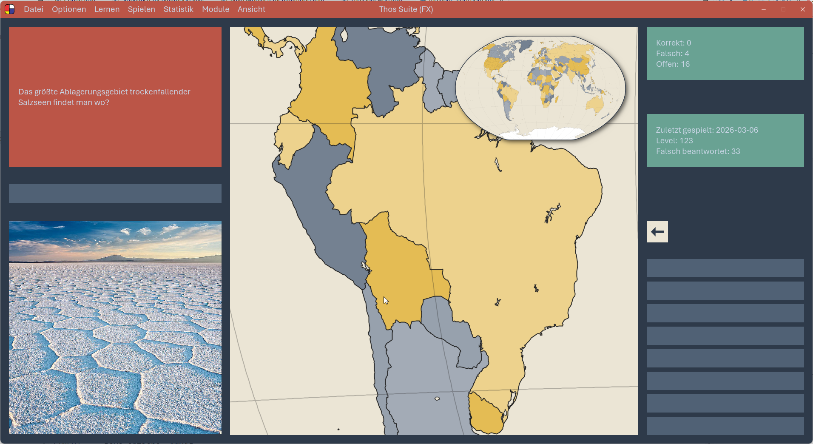
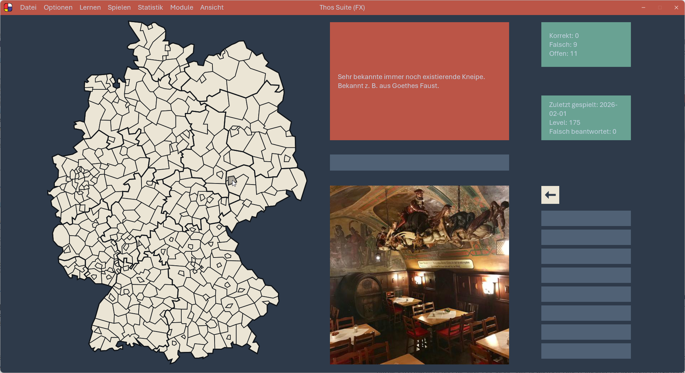
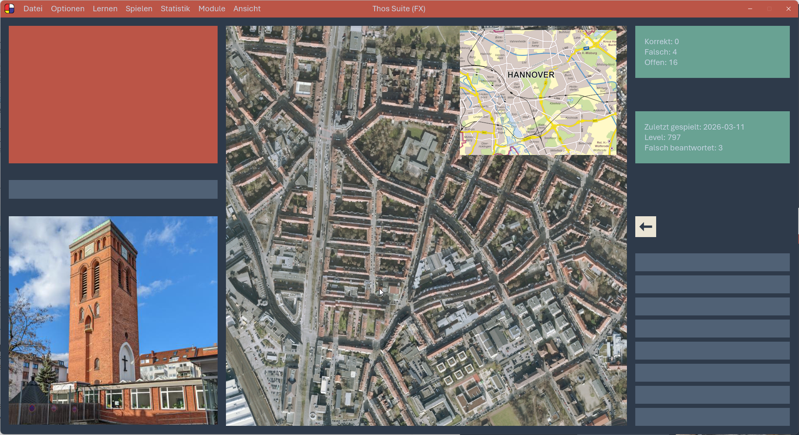
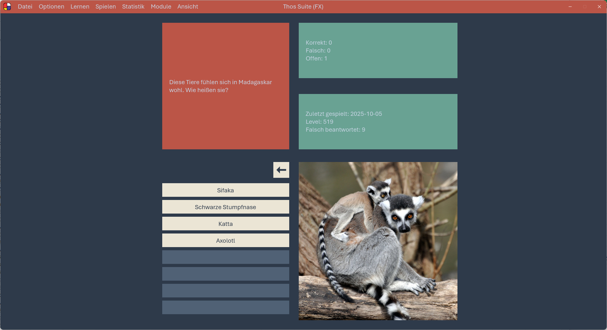
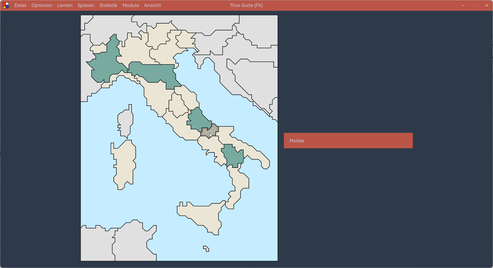

# Thos Suite

Ein persönliches Lernprogramm von Perminides für Perminides basierend auf
[Spaced Repetition](https://de.wikipedia.org/wiki/Spaced_Repetition). Zumeist basiert das Lernen auf
einer Landkarte: Man klickt an, wo etwas liegt, tippt Namen ein, beantwortet weiterführende Fragen
oder kreuzt bei Multiple Choice die richtige Antwort an. Es gibt fünf Lernbereiche:

- **Welt** — Orte und Sehenswürdigkeiten auf der Weltkarte anklicken, mit dem Wissen drumherum:
  Machu Picchu → welches Volk, welches Jahrhundert.
  
- **Deutschland** — einzelne Kreise und kreisfreie Städte auf der Deutschlandkarte, dazu alles,
  was zur Region gehört: kleinste Stadt, größte Wikingersiedlung, historische Sturmfluten.
  
- **Hannover** — die Straßen Hannovers lernen. Analog Welt.
  
- **Multiple Choice** — reines Faktenwissen ohne Karte.
  
- **Regionen-Serien** — eine Gebietsgruppe komplett durchgehen (US-Bundesstaaten, Schweizer
  Kantone, Kreise und Städte Niedersachsens und mehr): alle Gebiete auf der Karte finden oder
  benennen, am Ende bestanden oder nicht.
  

Um diesen Lernkern ist über die Jahre eine kleine Suite gewachsen: Fitness-Tracking, ein
Tagebuch, ein Nachrichten-Archiv, Filmbewertungen und ein paar kleinere Helfer.

## Dokumentation

Die Doku ist in folgende Teile geschnitten:

**[Architektur-Dokumentation](docs/Architektur-Dokumentation.md)** — 
Das einer LLM immer mitzugebende Fundament: Überblick, technische Basis, Paketstruktur,
Orchestrierungs-Mechanik, Startup. Was bei jeder Aufgabe gilt, egal welches Feature — die Karte
für den Wiedereinstieg nach Monaten Pause.

**[Design-Regeln](docs/Design-Regeln.md)** —
Das Regelwerk. Nach welchen Prinzipien die Suite in Pakete und Klassen geschnitten, benannt und
verbunden ist, und *warum*. Hier schlägt man nach, bevor man etwas Neues baut, damit es in
die Struktur passt.

**[Feature-Details](docs/Feature-Details.md)** —
Das Nachschlagewerk. Pro Feature, wie es konkret gebaut ist — Zweck, Mechanik, DB-Schema, Screen.
Man liest nur den Block, den man gerade braucht.

## Womit gebaut

JavaFX 25 · Java 25 LTS · SQLite · Jackson · `java.util.logging`. Build mit Maven, Deployment
über jpackage für Windows.

## Leitgedanken

Ein paar Grundhaltungen, die sich durch alles ziehen — ausführlich in den Design-Regeln:

- **Auffindbarkeit vor Eleganz.** Wichtigstes Ziel ist, nach Monaten den Ort einer Sache
  *vorhersagen* zu können, ohne zu suchen.
- **FailFast.** Unerwartetes crasht sofort mit Stacktrace, statt still weiterzulaufen.
- **Keine Tests.** Einziger Nutzer und Entwickler ist Thorsten; ein Fehler fällt im täglichen
  Gebrauch sofort auf.